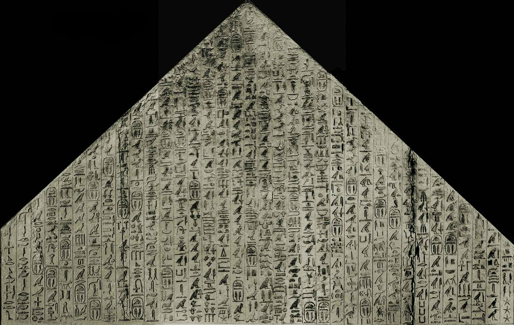
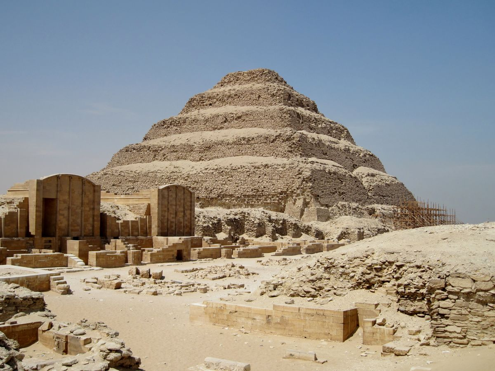
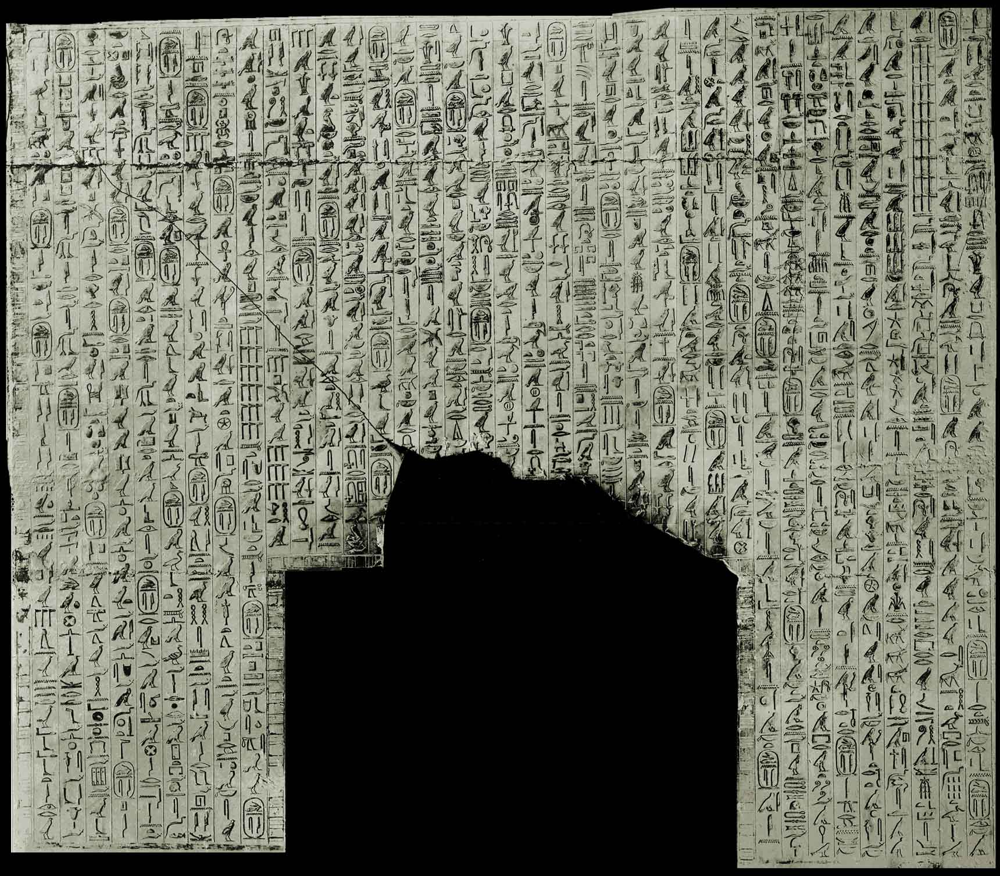
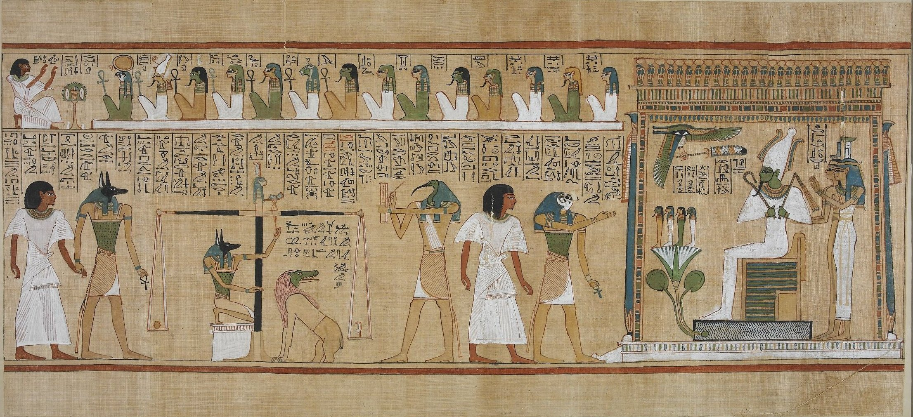
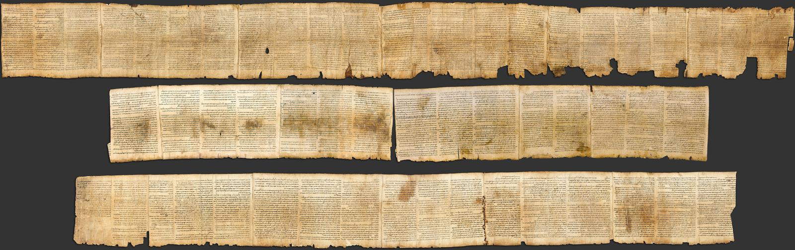
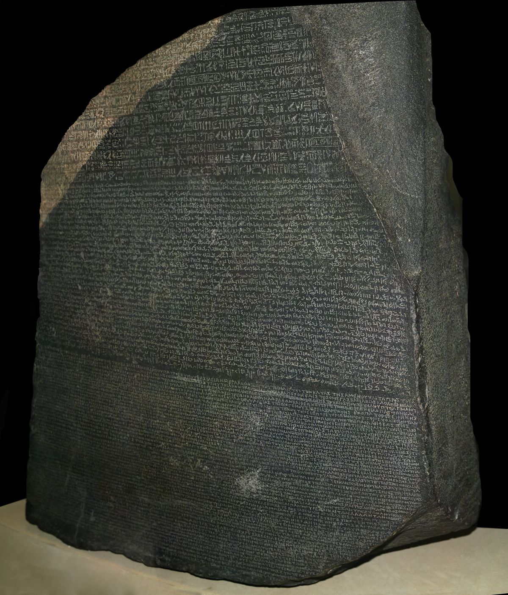

  

<h1 align="center">The Pyramid as Machine</h1>

<h3 align="center"><em>Spectral Engineering in the World's Oldest Religious Architecture</em></h3>

  <strong>Bryan Daugherty, CCI, CBI, SME &nbsp;·&nbsp; Shawn Ryan &nbsp;·&nbsp; Gregory Ward</strong> 
  <em>March 2026</em>

  <em>"The shape of power is the same, even when the language is different."</em>

---

  
   
  <em>The Saqqara necropolis — home of the world's oldest religious texts</em>

---

## The Discovery

The Pyramid Texts of Saqqara (c. 2353 BCE) are the oldest substantial body of religious literature known to humanity — 900 spells carved into the subterranean walls of royal pyramids to guide the pharaoh's soul into eternity.

**We discovered that these texts are not merely inscribed. They are *engineered*.**

Each wall surface of the pyramid has a measurable phonemic specification — a target consonant frequency profile determined by its ritual function. Serpent-repulsion spells on the west gable produce a different spectral signature than resurrection theology on the south wall. And these specifications were **replicated across pyramids** separated by decades, with tolerances tighter than the natural drift of literary tradition.

The pyramid is not a text repository. It is a **standardized ritual machine**.

  
   
  <em>Antechamber south wall, Pyramid of Unas — hieroglyphs above the passage to the burial chamber</em>

## Key Findings

| Finding | Evidence | Significance |
|---------|----------|-------------|
| **Each wall has a phonemic specification** | 15 wall-level entropy values (0.515–0.601) | The pyramid is a functional machine |
| **Specifications replicated across pyramids** | Δ < 0.02 between Unas, Teti, Pepi II | Standardized engineering across generations |
| **The register survives democratization** | Coffin Text Cannibal cosine = 0.9826 | Sound design is load-bearing |
| **Opposing walls are acoustic complements** | Serpent (guttural) vs Cannibal (nasal) face each other | The chamber is an acoustic instrument |
| **Embedded Semitic detected by the oracle** | JSD = 0.152 (highest split divergence) | Proto-Canaanite boundary identified phonemically |
| **DSS vs Masoretic Psalm 23** | Cosine = 0.9995 over 1,000 years | Highest scribal fidelity ever measured |
| **Greek John Prologue** | H_lock = 0.466 | Most compressed sacred text identified |
| **The gradient is universal** | 9 languages, 4,500 years, same hierarchy | Cultural function determines phonemic register |

## The Universal Compression Hierarchy

We analyzed **40+ sacred texts** across **nine language traditions** spanning **4,500 years**:

> Egyptian · Sumerian · Akkadian · Hebrew · Arabic · Greek · Ge'ez · Latin · Georgian

Every tradition produces the same gradient:

| Register | Mean H_lock | Function |
|----------|------------|----------|
| Theological mantra | **0.47** | Compressed declaration (Greek John Prologue) |
| Protective / apotropaic | **0.51** | Terse commands against threats |
| Divine self-revelation | **0.54** | "I AM THAT I AM" (Exodus 3:14) |
| Doctrinal / ethical | **0.55** | Core teachings and creeds |
| Apocalyptic / prophetic | **0.57** | Visionary formulae (1 Enoch, Isaiah) |
| Theological prose | **0.58** | Complex argumentation |
| Cosmogonic / creation | **0.59** | Naming the elements of the world |
| Liturgical creed | **0.61** | Elaborated instruction (Shema, Psalms) |
| Legislative / discursive | **0.62** | Law and enumeration |

**Protective texts compress. Creation narratives elaborate. This gradient has been stable for 4,500 years.**

  
   
  <em>The Weighing of the Heart from the Book of the Dead of Hunefer (c. 1275 BCE) — the moral judgment system that replaced the Cannibal Hymn's violent apotheosis when the afterlife was democratized</em>

## The Acoustic Architecture

The burial chamber of the Pyramid of Unas (~7.3 × 3.15 × 3.7 m, limestone) has a fundamental resonance at **23.5 Hz** — infrasound that falls in the human chest cavity resonance band (20–30 Hz).

The serpent spells (west gable) and the Cannibal Hymn (east gable) face each other across the chamber with **complementary acoustic profiles**:

- **Serpent spells**: 17.6% voiced stops, 13.2% pharyngeals → *guttural, percussive, transient* — felt in the chest
- **Cannibal Hymn**: 6.4% voiced stops, 50.9% sonorants → *nasal, flowing, sustained* — fills the space

The pyramid is not merely a machine. It is a **multi-driver acoustic system** with each wall tuned to produce a specific sound field when the texts are vocalized in the reverberant stone chamber.

## The Deeper Implication

The universality of the compression hierarchy across unrelated language families suggests a **natural law of symbolic communication** — not a cultural convention, but a functional necessity imposed by the physics of human cognition.

Oral formulaic texts compress because oral transmission **selects for memorability**. The Zipf exponent of the Pyramid Texts (α = −1.266, steeper than conversational language) indicates that ritual speech evolved **error-correcting properties** — the compression IS the redundancy that protects against corruption across millennia.

The offering formula *hetep di nesut* survived **2,000+ years** from the Pyramid Texts to the Book of the Dead. The Cannibal Hymn's sonorant register survived **350 years** of democratization with cosine similarity **0.9826**. The Hebrew scribes maintained Psalm 23 with **0.9995** fidelity across **1,000 years**.

These are not accidents. They are error-correcting codes, optimized by cultural evolution.

  
   
  <em>The Great Isaiah Scroll (1QIsa-a, c. 125 BCE) — the oldest near-complete biblical manuscript. Our analysis shows 0.9995 cosine similarity with the Masoretic text across 1,000 years of transmission.</em>

## The Book

**The Pyramid as Machine: Spectral Engineering in the World's Oldest Religious Architecture**

*85 pages · 34 chapters · 38 tables · 17 figures · 6 photographs · 4 appendices*

A comprehensive analysis spanning nine language traditions across 4,500 years, from the serpent spells of Saqqara to the Dead Sea Scrolls, from Enheduanna's temple hymn to the Quran, from the Emerald Tablet to the Gospel of John.

**Coming soon.**

  
   
  <em>The Rosetta Stone (196 BCE) — the key to Egyptian phonology</em>

## Methodology

The analysis maps the consonantal phonemes of ancient texts into Z₂₃ (the integers modulo 23, corresponding to the 23-consonant inventory of Old Egyptian) and applies nonlinear iteration to measure the phonemic frequency profile of each text. The resulting **entropy lock value** (H_lock) is a stable fingerprint of the text's consonantal palette — determined by its frequency distribution, not by word order.

The method is general: it applies to any discrete symbolic system with a fixed inventory. The findings are robust across different oracle functions (the primary oracle sits at the 61.6th percentile of 50,000 random alternatives), confirming that the results are about **phonemic compression** rather than any specific mathematical function.

## Data Sources

| Source | Texts | Consonants |
|--------|-------|------------|
| **Thesaurus Linguae Aegyptiae** (TLA) | 176 Pyramid Text spells | 17,905 |
| **ETCSL / CDLI** | 4 Sumerian texts | 699 |
| **Standard editions** (George, Abusch) | 3 Akkadian texts | 516 |
| **UCL Digital Egypt / DSS Digital Library** | 5 Hebrew texts | 714 |
| **Quranic Arabic Corpus** | 8 Quranic surahs | 779 |
| **Nawawi collection** | 10 Hadith excerpts | 654 |
| **Ethiopian biblical tradition** | 4 Ge'ez texts | 388 |
| **Classical sources** | Greek NT, Latin, Emerald Tablet | 654 |

## Citation

> Daugherty, B., Ryan, S., & Ward, G. (2026). *The Pyramid as Machine: Spectral Engineering in the World's Oldest Religious Architecture.* Manuscript.

## License

Text and analysis: All rights reserved. Publication forthcoming.

Images: Wikimedia Commons (CC BY-SA / Public Domain). See individual image pages for specific licenses.

---

  <em>"The shape of power is the same, even when the language is different."</em>
    
  <strong>The scribes weren't copying text. They were engineering an acoustic instrument. The writing system preserved the sound design.</strong>

